Azure Container Hands-on lab  
Jun. 2023

<br />

### Contents

- [Appendix 1: Dapr サービス間テレメトリの取得](#appendix-1-dapr-サービス間テレメトリの取得)

- [Appendix 2: Dapr を介した外部サービスへの接続](#appendix-2-dapr-を介した外部サービスへの接続)

<br />

## Appendix 1: Dapr サービス間テレメトリの取得

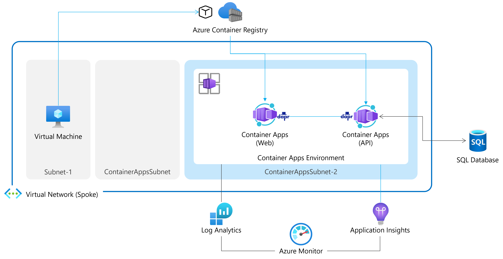

<br />

### Task 1: Application Insights の展開

- [Azure ポータル](#https://portal.azure.com)へアクセス

- "**＋リソースの作成**" をクリック

- "**カテゴリ**" から "**Web**" を選択、"**Application Insights**" の "**作成**" をクリック

  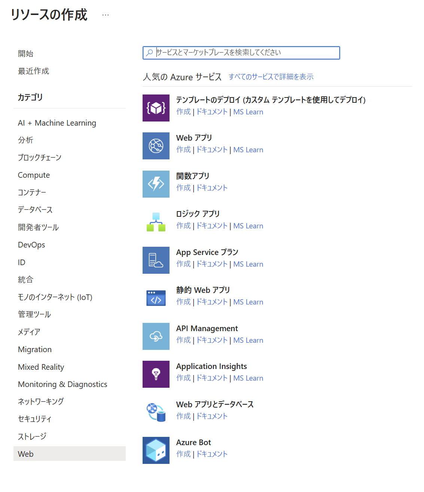

- Application Insights の作成

  - "**基本**"

    - "**プロジェクトの詳細**"

      - "**サブスクリプション**": ワークショップで使用中のサブスクリプション

      - "**リソース グループ**": ワークショップで使用中のリソース グループ

    - "**インスタンスの詳細**"

      - "**名前**": appi-workshop-q4 (任意)

      - "**地域**": 展開先のリージョンを選択

      - "**リソース モード**": ワークスペース

    - "**ワークスペースの詳細**"

      - "**サブスクリプション**": ワークショップで使用中のサブスクリプション

      - "**Log Analytics ワークスペース**": 事前展開済みの Log Analytics ワークスペース

    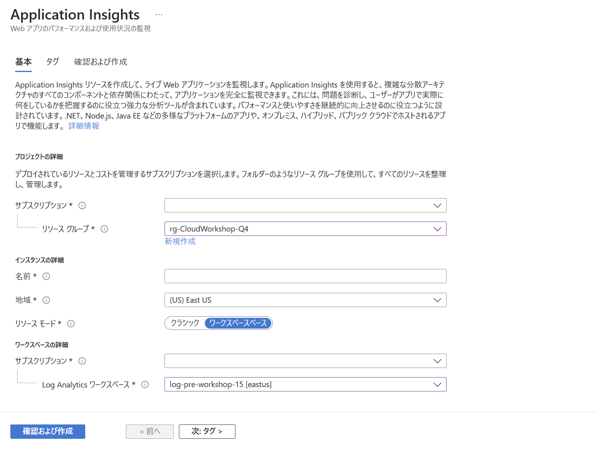

- "**確認および作成**" をクリック

- 指定した内容に問題ないことを確認し "**作成**" をクリック

<br />

### Task 2: サブネットの追加

- 仮想ネットワークの管理ブレードを表示

- "**サブネット**" を選択し、"**＋サブネット**" をクリック

- プレフィックス値 "**23**" のサブネットを追加

- サブネットが追加されたことを確認

  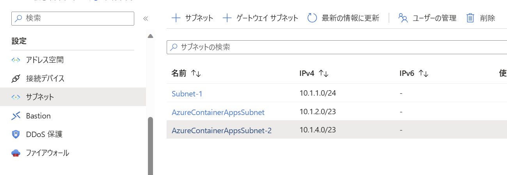

<br />

### Task 3: SQL Server のファイアウォールの構成

- SQL Server の管理ブレードへ移動、"**ネットワーク**" を選択

  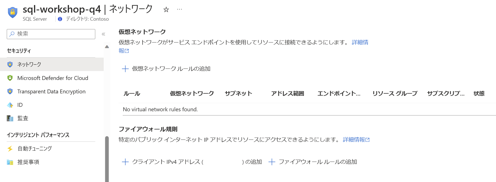

- "**パブリック アクセス**" タブを選択

  "**例外**" - "**Azure サービスおよびリソースにこのサーバーへのアクセスを許可する**" をオンに指定

  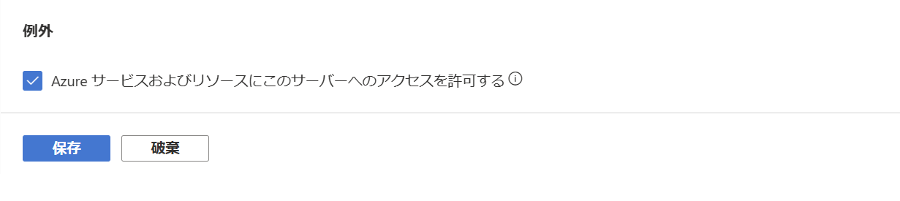

- "**保存**" をクリック

<br />

### Task 4: Container Apps 環境の作成

- ポータル画面の右上の  をクリックし、Cloud Shell を表示

  ※ PowerShell が選択されている場合は、"**Bash**" に変更

- 変数の定義

  ```
  CONTAINERAPPS_ENVIRONMENT='作成する Container Apps 環境の名前'
  ```

  ```
  RESOURCE_GROUP='展開先のリソース グループ名'
  ```

  ```
  LOCATION='展開先のリージョン'
  ```

  ※ 仮想ネットワークが展開されているリージョンを指定

  ```
  VNET_NAME='仮想ネットワーク名'
  ```

  ```
  SUBNET_NAME='サブネット名'
  ```

  ※ Task 2 で追加したサブネットの名前

  ```
  WORKSPACE_NAME='関連付ける Log Analytics ワークスペース名'
  ```

  ```
  APP_INSIGHTS='Application Insights 名'
  ```

  ※ Task 1 で作成した Application Insights の名前

- 展開先となるサブネットのリソース ID を取得

  ```
  INFRASTRUCTURE_SUBNET=`az network vnet subnet show --resource-group $RESOURCE_GROUP --vnet-name $VNET_NAME --name $SUBNET_NAME --query "id" -o tsv | tr -d '[:space:]'`
  ```

- Log Analytics ワークスペース ID を取得

  ```
  WORKSPACE_ID=`az monitor log-analytics workspace show --workspace-name $WORKSPACE_NAME --resource-group $RESOURCE_GROUP --query "customerId" -o tsv | tr -d '[:space:]'`
  ```

- Log Analytics ワークスペースの共有キーを取得

  ```
  WORKSPACE_KEY=`az monitor log-analytics workspace get-shared-keys --workspace-name $WORKSPACE_NAME --resource-group $RESOURCE_GROUP --query "primarySharedKey" -o tsv | tr -d '[:space:]'`
  ```

- Application Insights のインストルメンテーション キーを取得

  ```
  INSTRUMENTATION_KEY=`az resource show -g $RESOURCE_GROUP -n $APP_INSIGHTS --resource-type "microsoft.insights/components" --query properties.InstrumentationKey`
  ```

- Container Apps 環境を作成

  ```
  az containerapp env create \
    --name $CONTAINERAPPS_ENVIRONMENT \
    --resource-group $RESOURCE_GROUP \
    --location $LOCATION \
    --infrastructure-subnet-resource-id $INFRASTRUCTURE_SUBNET \
    --internal-only false \
    --logs-destination log-analytics \
    --logs-workspace-id $WORKSPACE_ID \
    --logs-workspace-key $WORKSPACE_KEY \
    --dapr-instrumentation-key $INSTRUMENTATION_KEY
  ```

  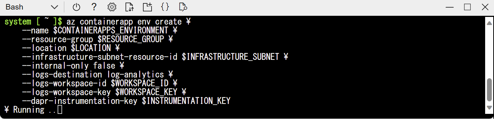

<br />

### Task 5: コンテナー アプリの作成

- Cloud Shell で作成するコンテナー アプリの名前 (API) を指定した変数を定義

  ```
  CONTAINERAPPS_NAME='コンテナー アプリの名前 (API)'
  ```

  ※ Container Apps 環境作成後に Cloud Shell を終了した場合は CONTAINERAPPS_ENVIRONMENT, RESOURCE_GROUP も定義

- コンテナー アプリ (API) の作成

  ```
  az containerapp create \
    --name $CONTAINERAPPS_NAME \
    --resource-group $RESOURCE_GROUP \
    --environment $CONTAINERAPPS_ENVIRONMENT \
    --ingress external \
    --target-port 80
  ```

- 作成するコンテナー アプリの名前 (Web) を指定した変数を定義

  ```
  CONTAINERAPPS_NAME='コンテナー アプリの名前 (Web)'
  ```

- コンテナー アプリ (Web) の作成

  ```
  az containerapp create \
    --name $CONTAINERAPPS_NAME \
    --resource-group $RESOURCE_GROUP \
    --environment $CONTAINERAPPS_ENVIRONMENT \
    --ingress external \
    --target-port 80
  ```

<br />

### Task 6: API アプリの展開

- 展開したコンテナー アプリ (API) の管理ブレードへ移動し、"**シークレット**" を選択

- "**＋追加**" をクリック

- SQL Database への接続文字列をシークレットへ追加

  - "**キー**": sqlconnectionstring

  - "**種類**": Container Apps シークレット

  - "**値**": SQL Database への接続文字列

    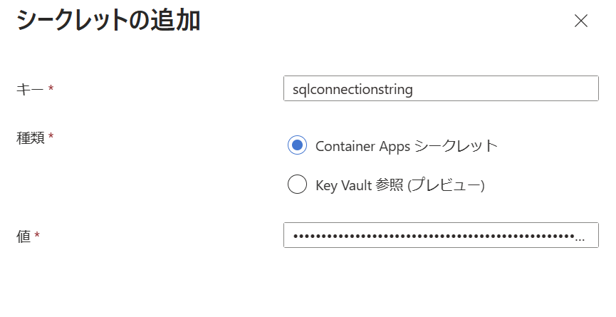

  ※ SQL Database の接続文字列

  <details>
    <summary>C#</summary>

  ADO.NET (SQL 認証) の接続文字列

  ```
  Server=tcp:{your_sql_server}.database.windows.net,1433;Initial Catalog=AdventureWorksLT;Persist Security Info=False;User ID=sqladmin;Password={your_password};MultipleActiveResultSets=False;Encrypt=True;TrustServerCertificate=False;Connection Timeout=30;
  ```

  ※ {your_sql_server}, {your_password} は使用するものに変更
  </details>

  <details>
    <summary>Java</summary>

  JDBC (SQL 認証) の接続文字列

  ```
  jdbc:sqlserver://{your_sql_server}.database.windows.net:1433;database=AdventureWorksLT;user=sqladmin@{your_sql_server};password={your_password_here};encrypt=true;trustServerCertificate=false;hostNameInCertificate=*.database.windows.net;loginTimeout=30;
  ```

  ※ {your_sql_server}, {your_password} は使用するものに変更
  </details>

<br />

- "**＋追加**" をクリック

<br />

- "**リビジョン管理**" を選択し "**＋新しいリビジョンを作成**" をクリック

- クイックスタート イメージをチェックし "**削除**" をクリック

  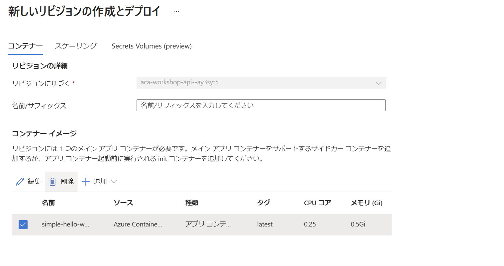

- コンテナー イメージの "**＋追加**" - "**アプリ コンテナー**" をクリック

  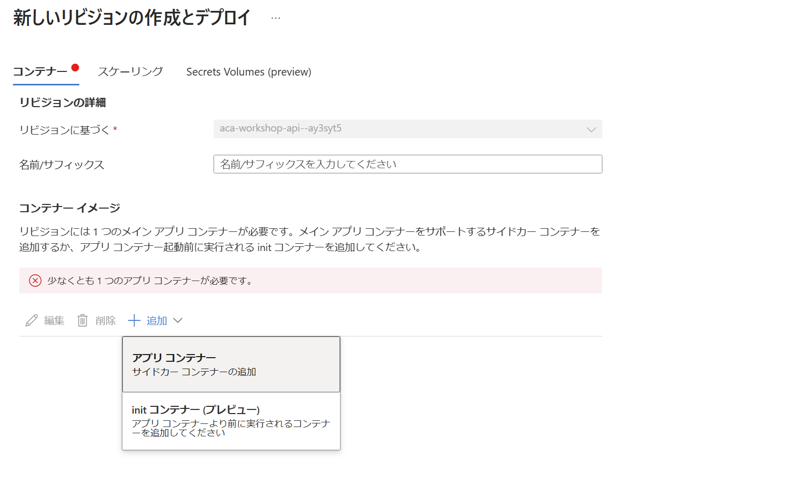

- コンテナーの追加

  - "**コンテナーの詳細**"

    - "**名前**": mcw-backend-api

    - "**イメージのソース**": Azure Container Registry

    - "**認証**": 管理者資格情報

    - "**レジストリ**": ワークショップで使用中のコンテナー レジストリを選択

    - "**イメージ**": api

    - "**イメージ タグ**": v1

  - "**コンテナー リソースの割り当て**"

    - "**CPU コア**": 0.25

    - "**メモリ (Gi)**": 0.5

  - "**環境変数**"

    ※ "**＋追加**" をクリックし、SQL Database への接続文字列を環境変数として追加

    - SQL 接続文字列

      - "**名前**": SqlConnectionString

      - "**ソース**": シークレットの参照

      - "**値**": sqlconnectionstring

    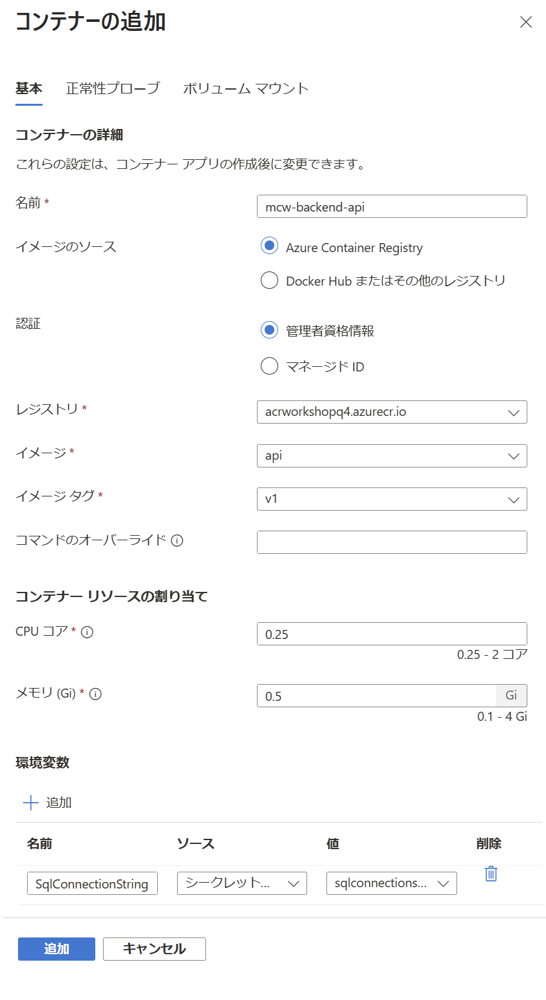

- "**追加**" をクリック

- "**作成**" をクリック

- 新しく展開したリビジョンの実行状態が Running であることを確認

- "**概要**" タブを選択し、"**アプリケーション URL**" をコピー

- Web ブラウザでコピーした FQDN の /api/Product エンドポイントへアクセス

  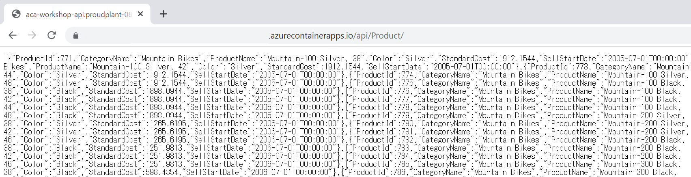

<br />

- コンテナー アプリ (API) の管理ブレードへ移動し、"**イングレス**" を選択

- イングレス トラフィックを "**Container Apps 環境に限定**" に変更し、"**保存**" をクリック

  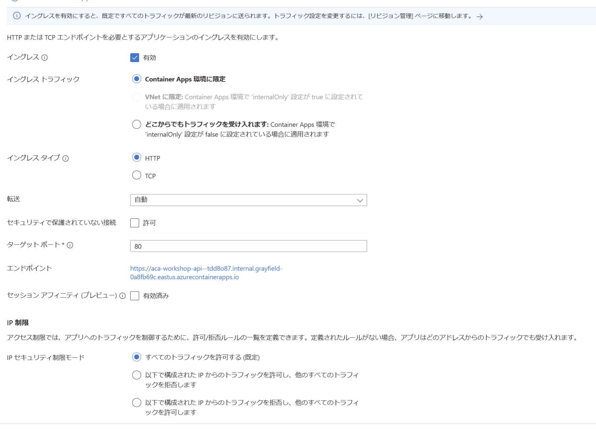

- "**概要**" タブを選択し、"**アプリケーション URL**" をコピー

- Web ブラウザでコピーした FQDN の /api/Product エンドポイントへアクセス

- アクセスが拒否されることを確認

  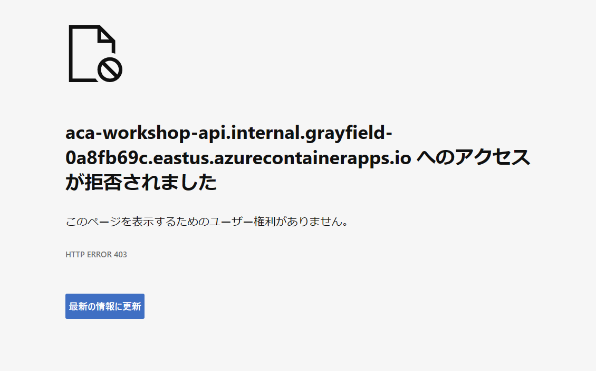

<br />

- コンテナー アプリ (API) の管理ブレードへ移動し、"**Dapr**" を選択

- Dapr 設定を "**有効**" に変更、アプリ ID、プロトコル、ログの指定を行い "**保存**" をクリック

  - "**アプリ ID**": backend-api

  - "**プロトコル**": HTTP

  - "**API ログ**": オン

  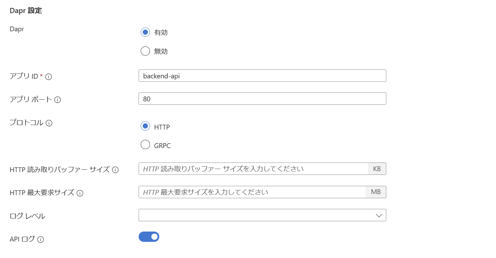

- 確認のメッセージが表示されるので "**続行**" をクリック

  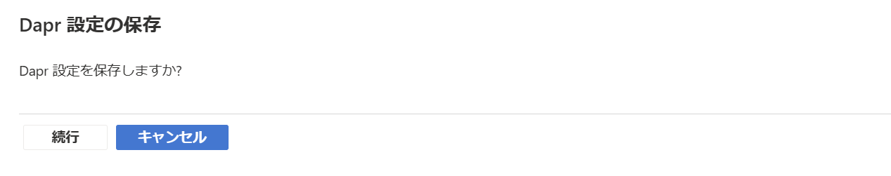

<br />

### Task 7: Web アプリの展開

- コンテナー アプリ (Web) の管理ブレードへ移動

- "**リビジョン管理**" を選択し "**＋新しいリビジョンを作成**" をクリック

- クイックスタート イメージをチェックし "**削除**" をクリック

  

- コンテナー イメージの "**＋追加**" - "**アプリ コンテナー**" をクリック

- コンテナーの追加

  - "**コンテナーの詳細**"

    - "**名前**": mcw-frontend-ui

    - "**イメージのソース**": Azure Container Registry

    - "**認証**": 管理者資格情報

    - "**レジストリ**": ワークショップで使用中のコンテナー レジストリを選択

    - "**イメージ**": api

    - "**イメージ タグ**": v1

  - "**コンテナー リソースの割り当て**"

    - "**CPU コア**": 0.25

    - "**メモリ (Gi)**": 0.5

  - "**環境変数**"

    ※ "**＋追加**" をクリックし、環境変数を追加

    - Dapr アプリ ID

      - "**名前**": AppId

      - "**値**": backend-api (API アプリの Dapr アプリ ID)

    

- "**追加**" をクリック

- "**作成**" をクリック

<br />

- コンテナー アプリ (API) の管理ブレードの "**Dapr**" を選択

- Dapr 設定を "**有効**" に変更、アプリ ID、プロトコル、ログの指定を行い "**保存**" をクリック

  - "**アプリ ID**": frontend-ui

  - "**プロトコル**": HTTP

  - "**API ログ**": オン

  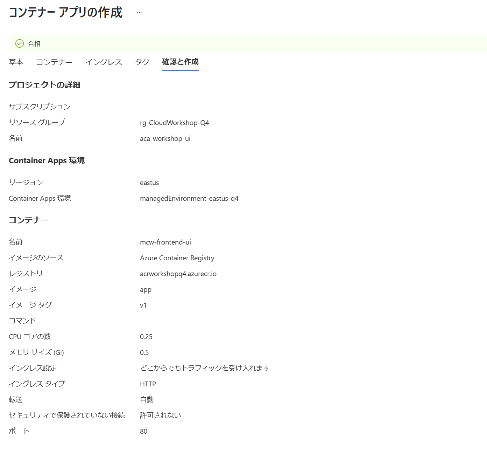

<br />

- 新しく展開したリビジョンの実行状態が Running であることを確認

- "**概要**" タブを選択し、"**アプリケーション URL**" をクリック

- 新しいタブでアプリが表示

  

<br />

### Task 8: アプリケーション マップの確認

- Task 1 で追加した Application Insights の管理ブレードへ移動

- "**アプリケーション マップ**" を選択

  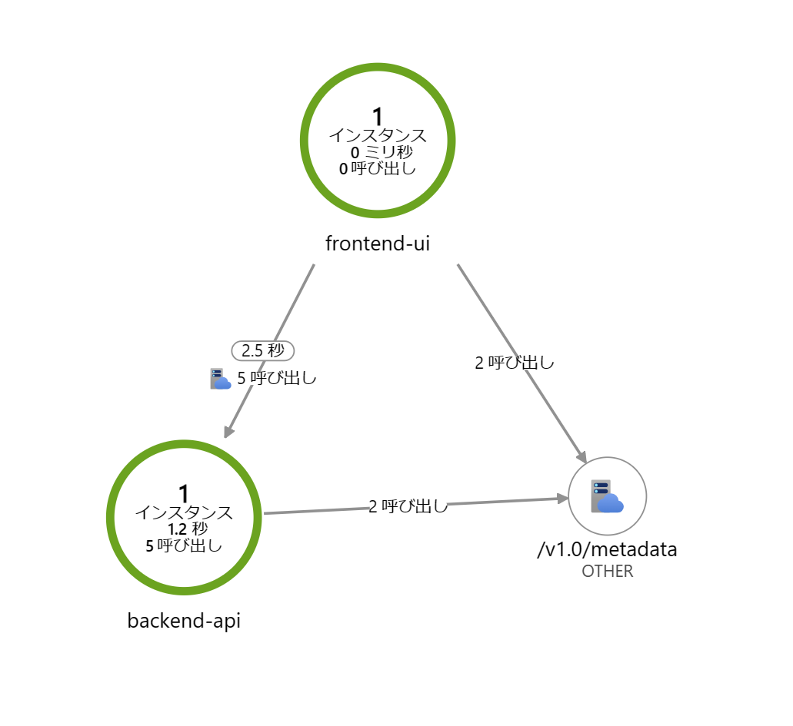

  ※ レイアウト変更も可

  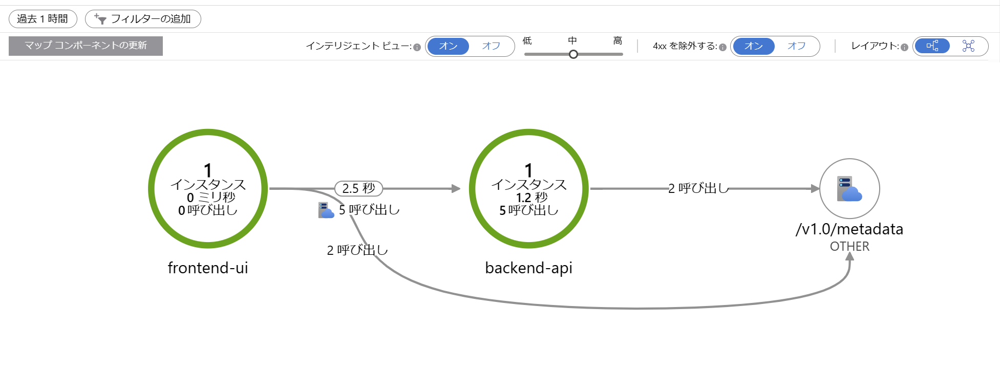

<br />

## Appendix 2: Dapr を介した外部サービスへの接続

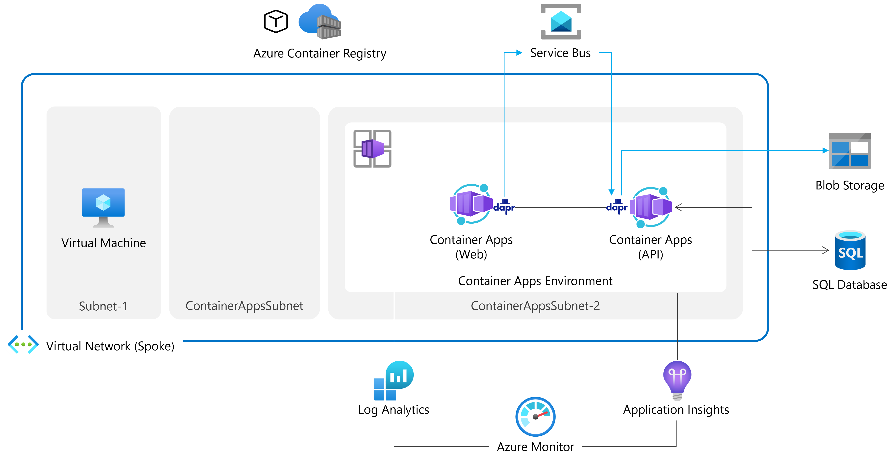

<br />

### Task 1: Dapr コンポーネントの登録

- Container Apps 環境の管理ブレードへ移動し、"**Dapr コンポーネント**" を選択

- "**＋追加**" - "**汎用コンポーネント**" をクリック

  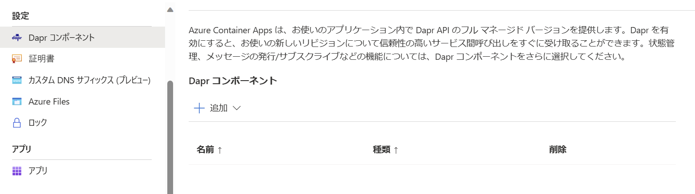

- Dapr コンポーネントの追加

  - "**Dapr コンポーネントの詳細**"

    - "**名前**": pubsub-servicebus

    - "**コンポーネントの種類**": pubsub.azure.servicebus.topics

    - "**バージョン**": v1

  - "**シークレット**"

    - "**＋追加**" をクリックし、Service Bus への接続文字列を追加

      - "**名前**": sb-root-connectionstring

      - "**値**": RootManageSharedAccessKey のプライマリ接続文字列

        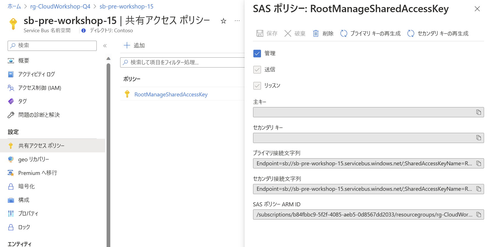

  - "**メタデータ**"

    - "**追加**" をクリックし、Service Bus への接続文字列を格納したシークレットを指定

      - "**名前**": connectionString

      - "**ソース**": シークレットの参照

      - "**値**": sb-root-connectionstring

  - "**スコープ**"

    - "**追加**" をクリックし、Dapr のアプリ ID を登録

      - "**アプリ ID**": frontend-ui, backend-api

        ※ コンテナー アプリの Dapr 設定で指定したアプリ ID を指定

    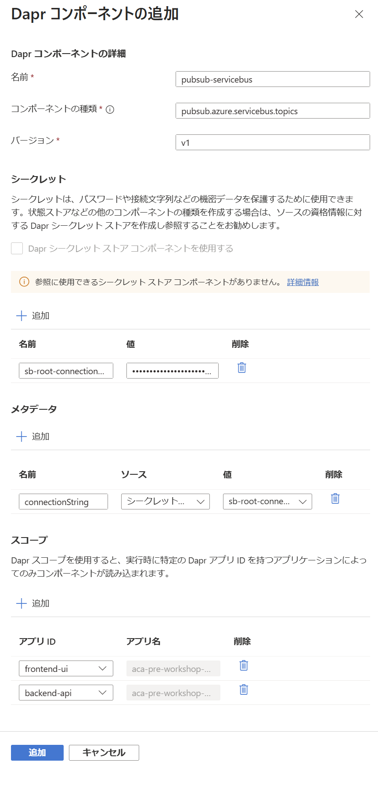

- "**＋追加**" - "**汎用コンポーネント**" をクリック

  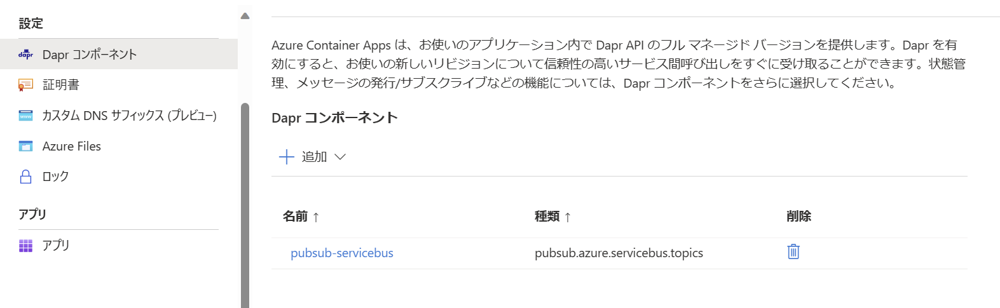

- Dapr コンポーネントの追加

  - "**Dapr コンポーネントの詳細**"

    - "**名前**": externalblobstore

    - "**コンポーネントの種類**": bindings.azure.blobstorage

    - "**バージョン**": v1

  - "**シークレット**"

    - "**＋追加**" をクリックし、ストレージ アカウントのキーを追加

      - "**名前**": storageaccesskey

      - "**値**": キー

        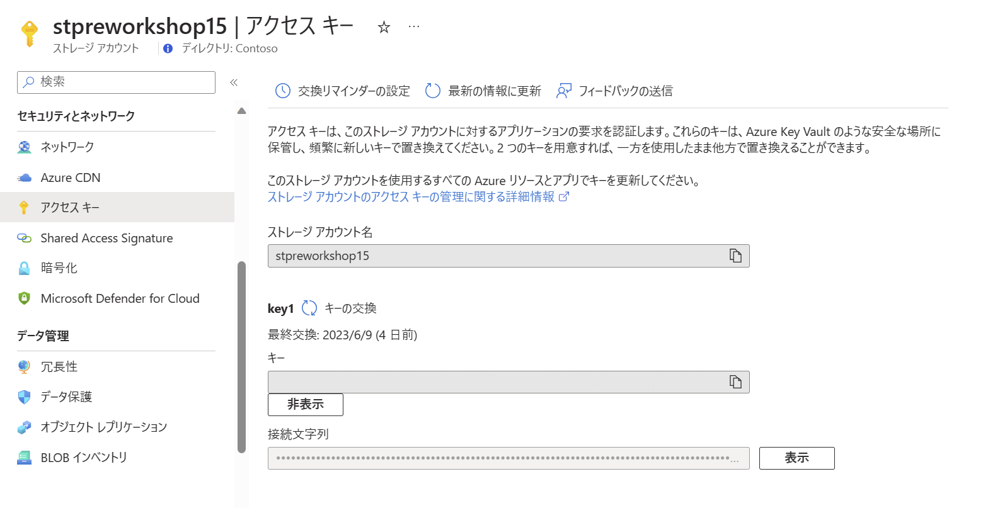

  - "**メタデータ**"

    - "**追加**" をクリックし、以下３つのメタデータを追加

      - ストレージ アカウント名

        - "**名前**": accountName

        - "**ソース**": 手動エントリ

        - "**値**": ストレージ アカウント名

      - キー

        - "**名前**": accountKey

        - "**ソース**": シークレットの参照

        - "**値**": キー

      - コンテナ名

        - "**名前**": containerName

        - "**ソース**": 手動エントリ

        - "**値**": orders

  - "**スコープ**"

    - "**追加**" をクリックし、Dapr のアプリ ID を登録

      - "**アプリ ID**": backend-api

        ※ コンテナー アプリの Dapr 設定で指定したアプリ ID を指定

    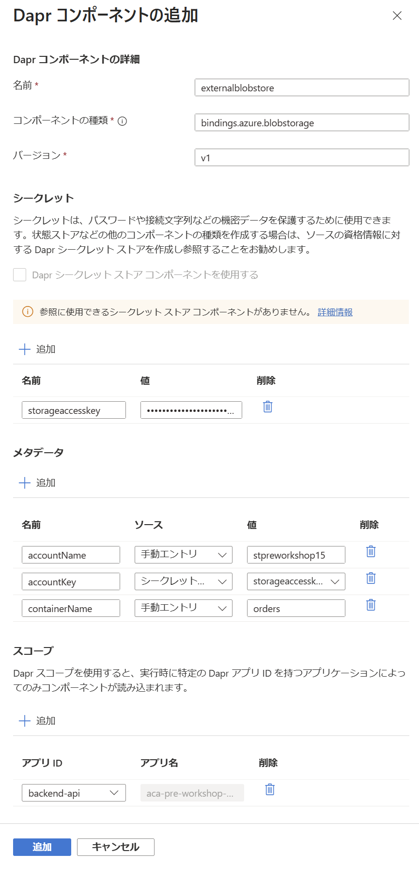

- ２つのコンポーネントが登録されたことを確認

  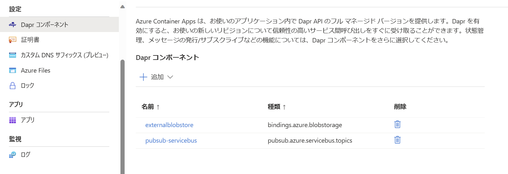

<br />

- コンテナー アプリの管理ブレードへ移動し、"**Dapr**" を選択

  ※ Container Apps 環境に登録した Dapr コンポーネントが表示されることを確認

  - Web アプリ

    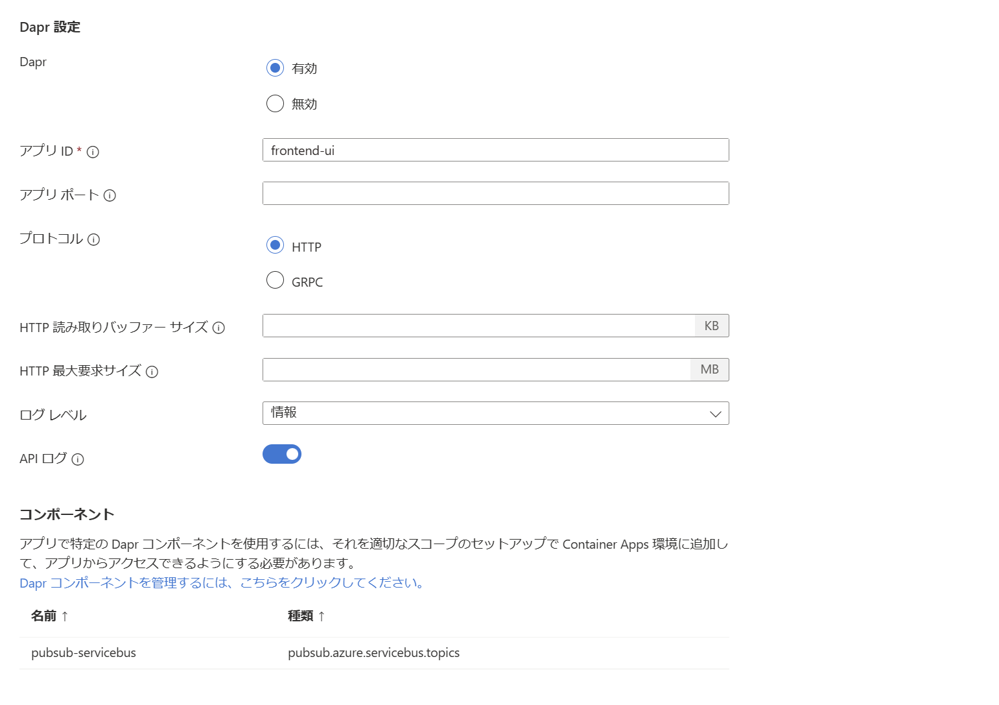

  - API アプリ

    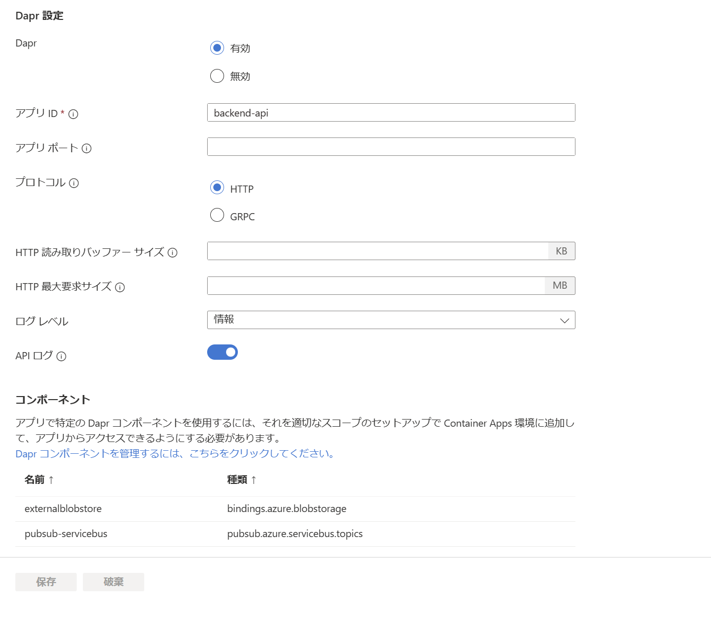

<br />

### Task 2: 動作確認

<details>
  <summary>C#</summary>
- コンテナー アプリ (Web) の管理ブレードへ移動し、"**概要**" タブを選択

- "**アプリケーション URL**" をクリックし、新しいタブでアプリケーションを表示

- "**Order**" をクリック、Count に数値を入力し "**Send**" をクリック

  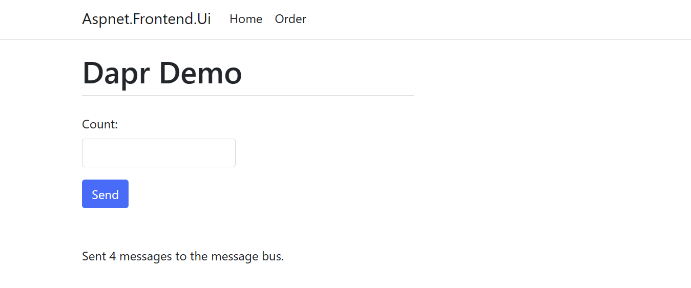

- コンテナー アプリ (Web) の管理ブレードへ移動し、"**ログ ストリーム**" を選択

  ※ 入力した数値と同数のログが記録されていることを確認

  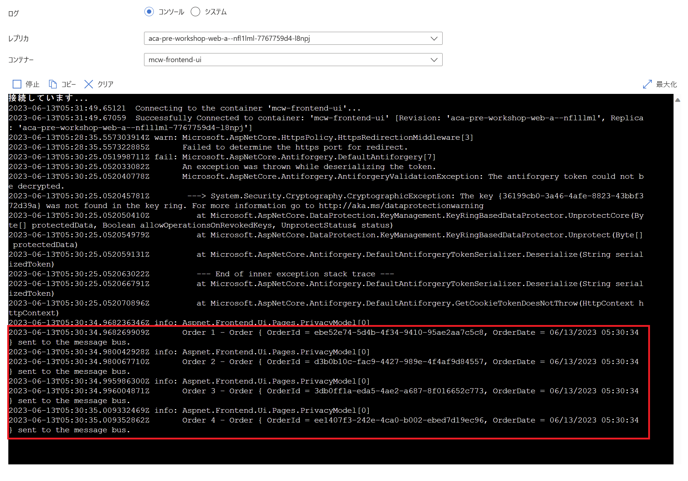

- Service Bus の管理ブレードでもメッセージを受信していることを確認

  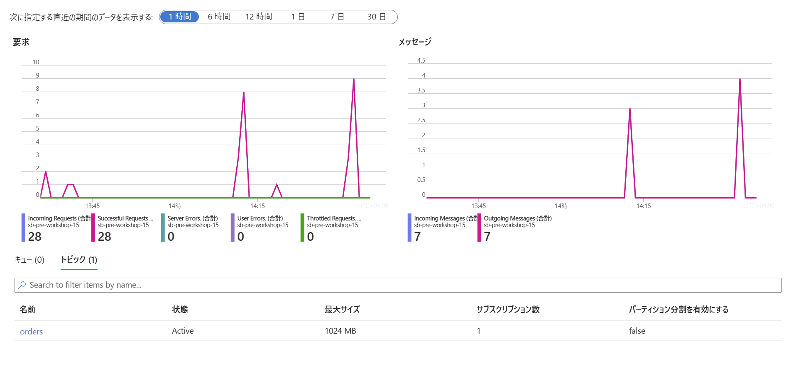

- ストレージ アカウントの管理ブレードへ移動し、"**コンテナー**"を選択

- "**orders**" をクリックし、ファイルが保存されていることを確認

  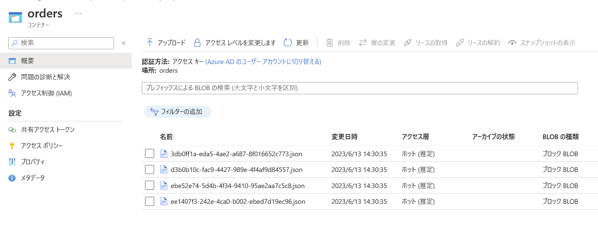

- Application Insights の管理ブレードへ移動し、"**アプリケーション マップ**" を選択

  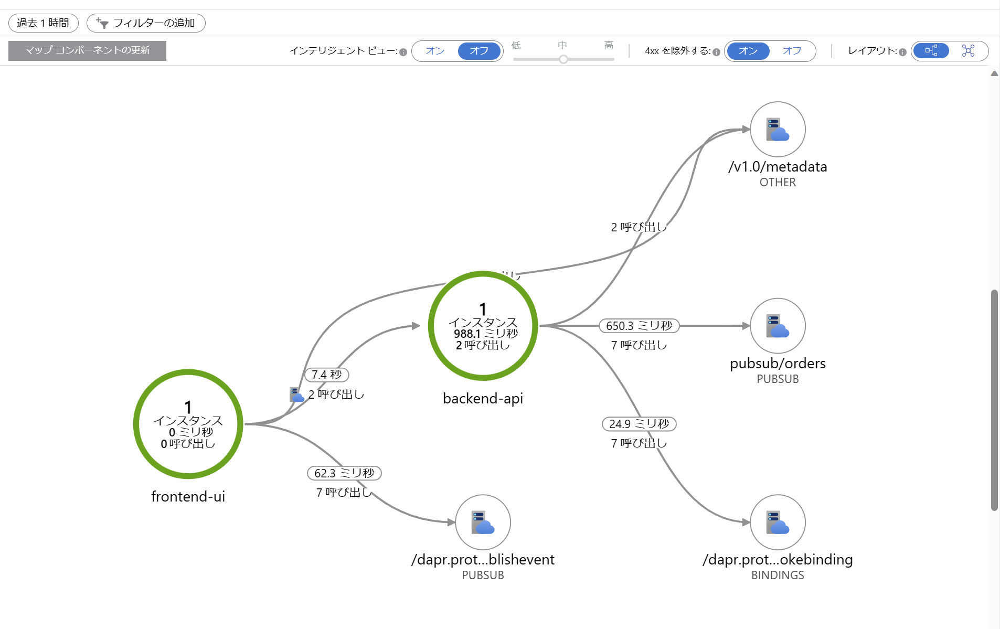

</details>

<details>
  <summary>Java</summary>
- コマンドプロンプトから以下のコマンドを実行

```
curl -X POST  <FrontEndアプリのURL>/Orders
```

- コンテナー アプリ (Web) の管理ブレードへ移動し、"**ログ ストリーム**" を選択

  ※ ログが記録されていることを確認

  

- Service Bus の管理ブレードでメッセージを受信していることを確認

  

</details>
