Azure Container Hands-on lab  
Jun. 2023

<br />

### Contents

<br />

## 環境の準備

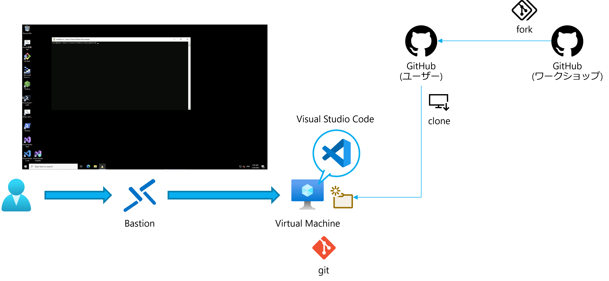

### SQL Server の設定

- [Azure ポータル](#https://portal.azure.com)へアクセス

- 事前展開済みの SQL Server の管理ブレードへ移動し、"**Azure Active Directory**" を選択

- "**管理者の設定**" をクリック

  

- ポータルへのサインインに使用しているユーザーを選択

- "**保存**" をクリック

  

- "**ネットワーク**" を選択

- "**ファイアウォール規則**" の "**＋クライアント IPv4 アドレス (xxx.xxx.xxx.xxx) の追加**" をクリック

  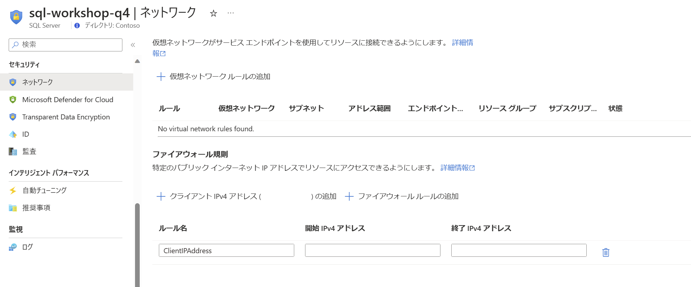

- "**保存**" をクリック

<br />

### 仮想マシンへの接続

- 事前展開済みの仮想マシンの管理ブレードへ移動し、"**接続**" - "**Bastion**" を選択

  

- ユーザー名、パスワードを指定し、仮想マシンへ接続

  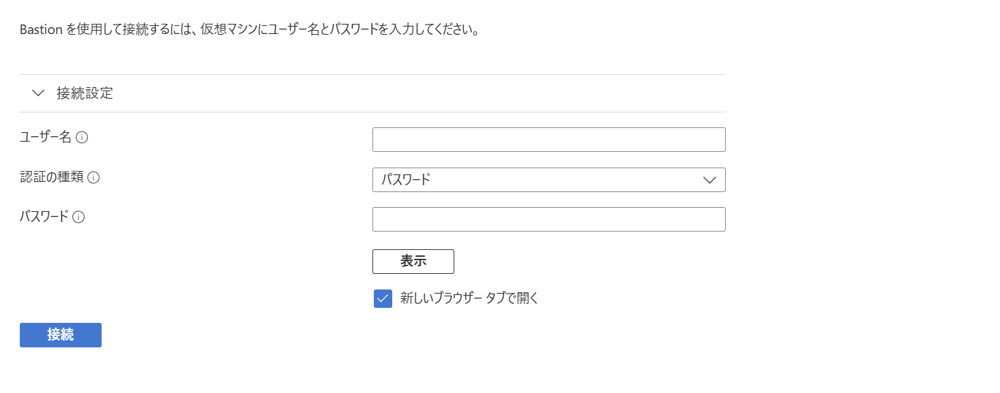

- 新しいタブで仮想マシンへの接続を行い、デスクトップ画面が表示

<br />

### Task 1: リポジトリのフォーク

- Web ブラウザを起動し、[ワークショップのリポジトリ](#https://github.com/kohei3110/AzureContainerApps-Hands-on-Lab-1)へ移動

- 画面右上の "**Fork**" をクリック

  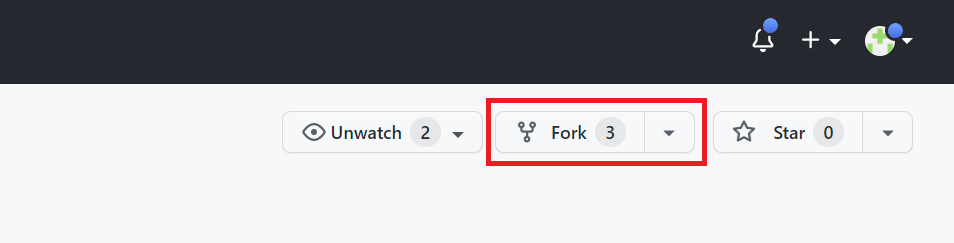

- 自身のアカウントにリポジトリが複製されていることを確認

<br />

### Task 2: Git の初期構成

- Visual Studio Code を起動 (デスクトップ上の準備されたショートカットをダブルクリック)

- "**Terminal**" - "**New Terminal**" を選択し、ターミナルを表示

  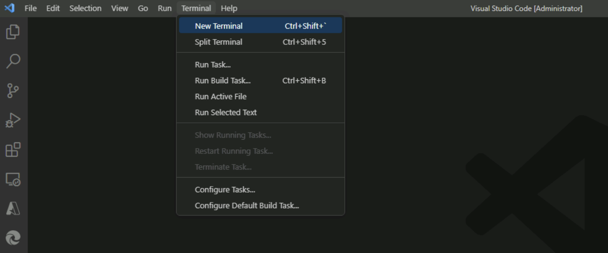

- Git の初期設定を実行

  - ユーザー名の設定

    ```
    git config --global user.name "User Name"
    ```

    ※ User Name を自身の名前に変更

  - Email アドレスの設定

    ```
    git config --global user.email "Email@Address"
    ```

    ※ {Email Address} を使用するメール アドレスに変更

  - 設定値の確認

    ```
    git config --list --global
    ```

    ※ 設定したユーザー名・メール アドレスが出力されたら OK

<br />

### Task 3: 開発環境へのリポジトリのクローン

- Web ブラウザで Fork したリポジトリの "**Code**" をクリック

  表示されるツール チップよりリポジトリの URL をコピー

  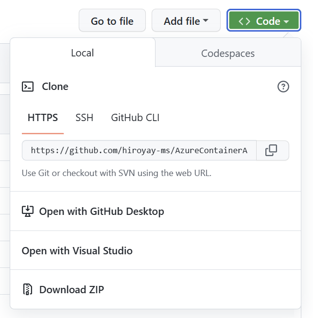

- Visual Studio Code のサイドバーから Explorer を選択し "**Clone Repository**" をクリック

  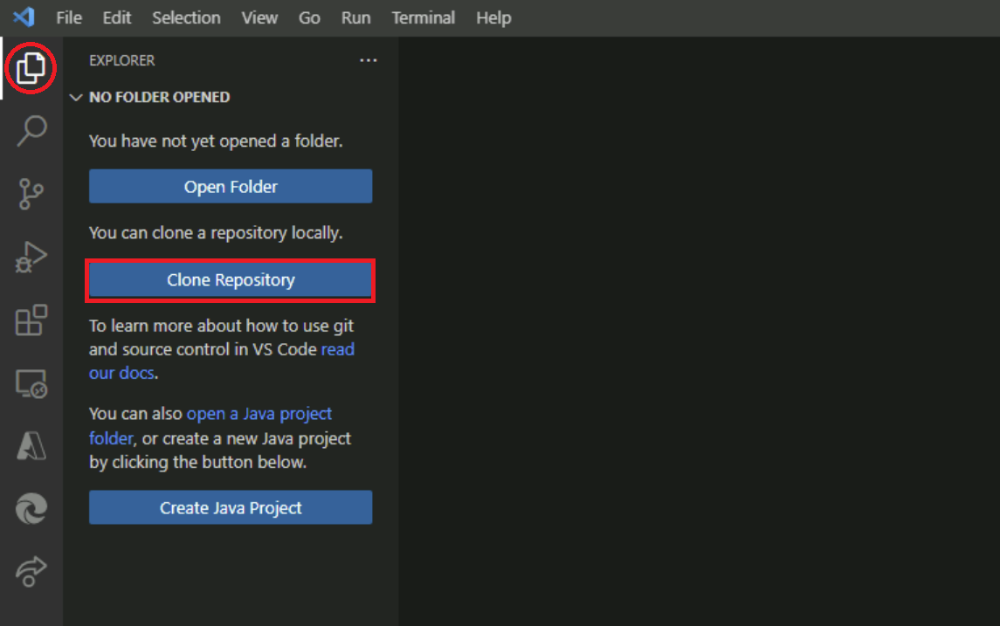

- リポジトリの URL の入力を求められるためコピーした URL を貼り付け Enter キーを押下

  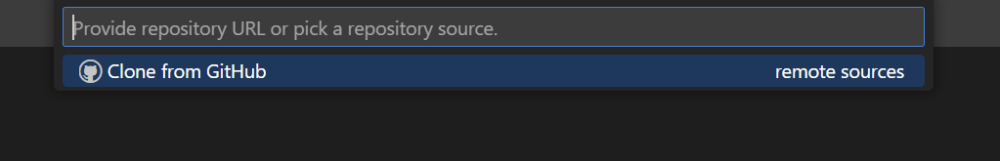

- 複製先となるローカル ディレクトリ (Documents) を選択

  GitHub の認証情報が求められる場合は、アカウント名、パスワードを入力し認証を実施

- 複製されたリポジトリを開くかどうかのメッセージが表示されるので "**Open**" をクリック

- Explorer に複製したリポジトリのディレクトリ、ファイルが表示

  ```
  git remote -v
  ```

  - **クローン先の GitHub URL が出力されたら OK
  
    - <自分のアカウント名>/AzureContainerApps-Hands-on-Lab-2 になっていることを確認
    
    -  (kohei3110/AzureContainerApps-Hands-on-Lab-2になっていないことを確認)** 

<br />

## Exercise 1: 仮想ネットワークへのコンテナー アプリの展開

### Task 1: サブネットの追加

- [Azure ポータル](#https://portal.azure.com)へアクセス

- 事前に展開された仮想ネットワークの管理ブレードを表示

- "**サブネット**" を選択し、"**＋サブネット**" をクリック

  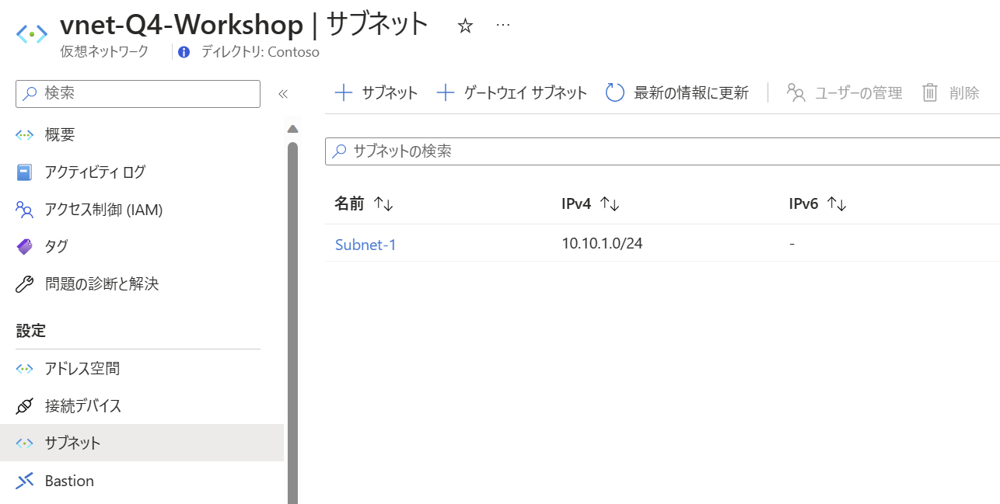

- プレフィックス値 "**23**" のサブネットを追加

  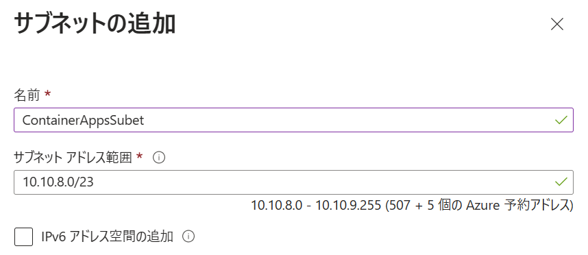

- サブネットが追加されたことを確認

  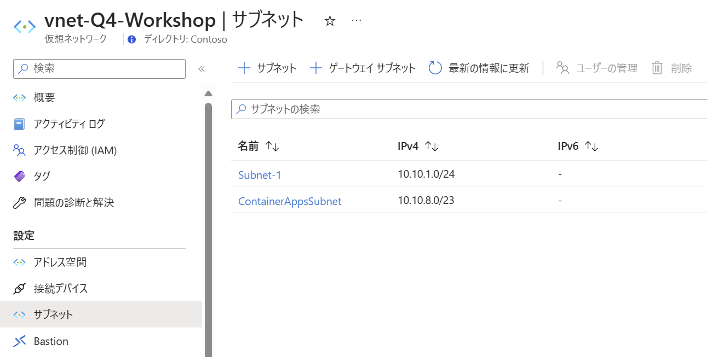

<br />

### Task 2: コンテナー アプリの作成

- "**＋リソースの作成**" をクリック

  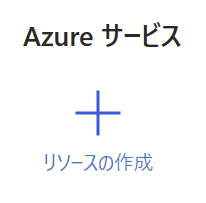

- カテゴリから "**コンテナー**" を選択し、、コンテナー アプリの "**作成**" をクリック

  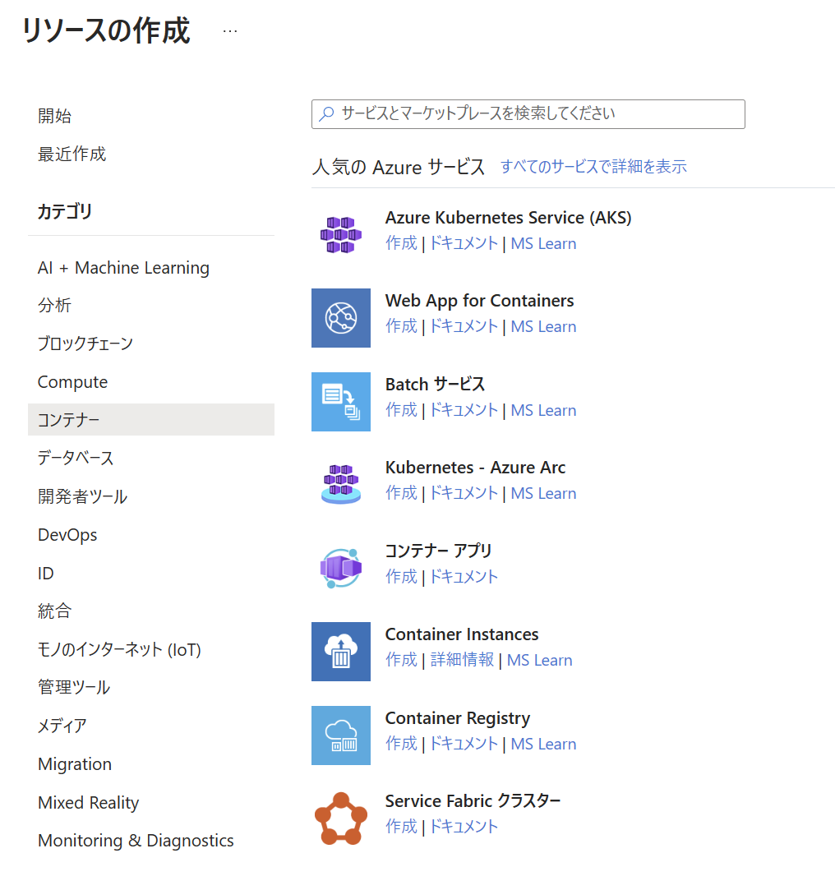

- Container Apps 環境の地域を選択し "**新規作成**" をクリック

  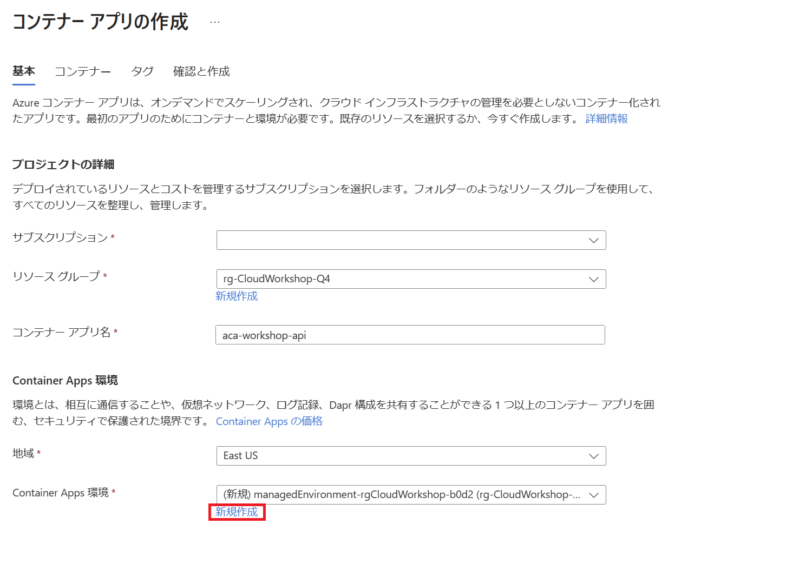

  - Container Apps 環境の作成

    - "**基本**"

      - "**環境名**": 任意

      - "**プラン**": 従量課金

      - "**ゾーン冗長**": 無効

      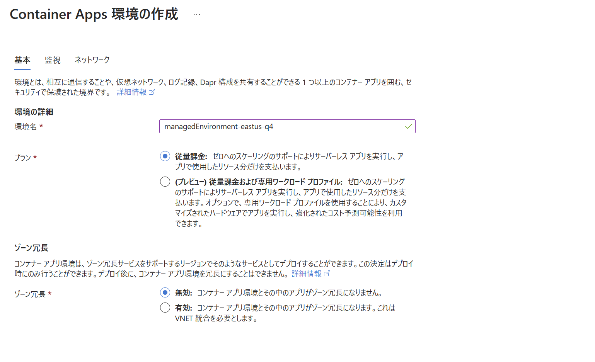

    - "**監視**"

      - "**ログ出力方法**": Azure ログ分析

      - "**Log Analytics ワークスペース**": 事前に展開済みのワークスペースを選択

      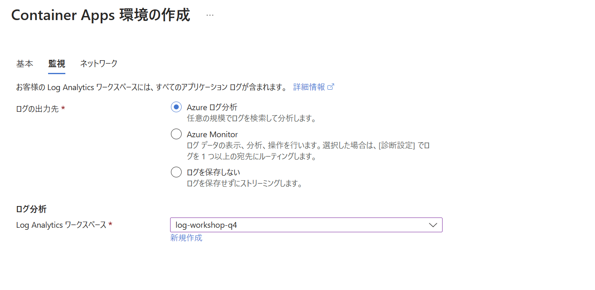

    - "**ネットワーク**"

      - "**自分の仮想ネットワークを使用する**": はい

      - "**仮想ネットワーク**": 事前に展開済みの仮想ネットワークを選択

      - "**インフラストラクチャ サブネット**": 先の手順で追加したサブネットを選択

      - "**仮想 IP**": 外部

      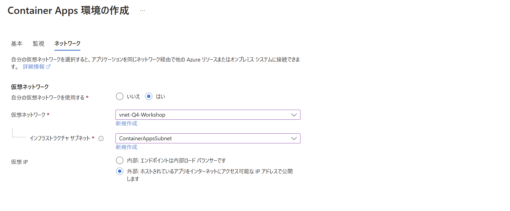

    - "**作成**" をクリック

- "**基本**" タブ

  - "**プロジェクトの詳細**"

    - "**サブスクリプション**": ワークショップで使用中のサブスクリプションを選択

    - "**リソース グループ**": ワークショップで使用中のリソース グループを選択

    - "**コンテナー アプリ名**": 任意

  - "**Container Apps 環境**"

    - "**地域**": 先の手順で選択済み

    - "**Container Apps 環境**": 作成した Container Apps 環境が選択されていることを確認

    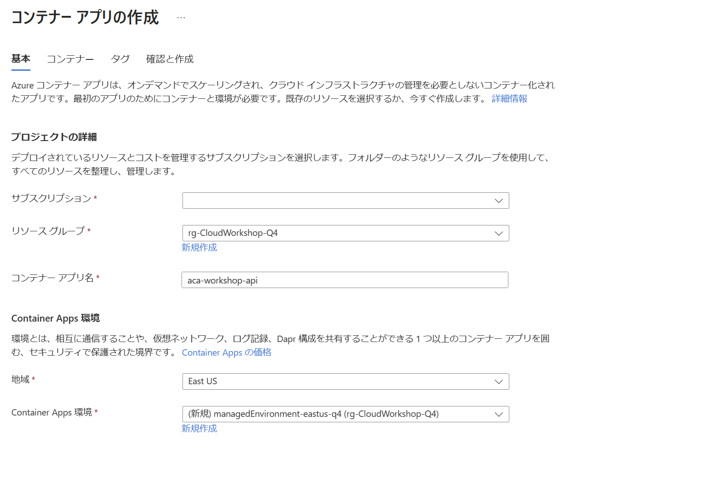
  
  - "**コンテナー**"
  
    - "**クイックスタート イメージを使用する**": チェック

    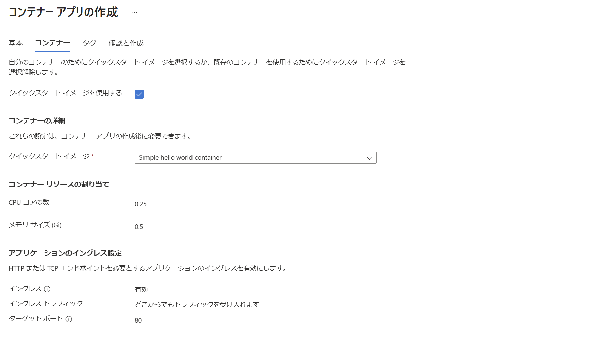

- "**確認と作成**" をクリック

- 指定した内容に問題ないことを確認し "**作成**" をクリック

  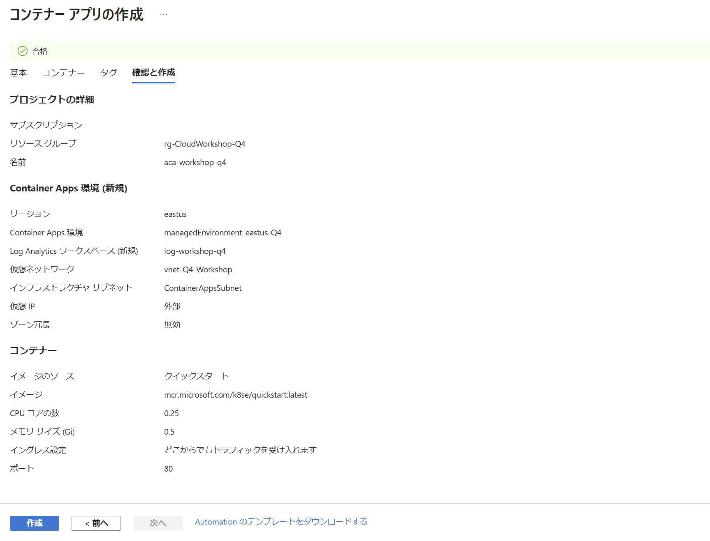

- 作成したコンテナー アプリの管理ブレードへ移動

  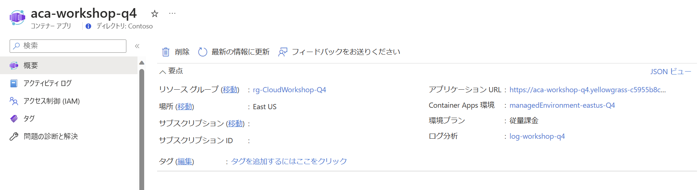

- "**アプリケーション URL**" をクリック

  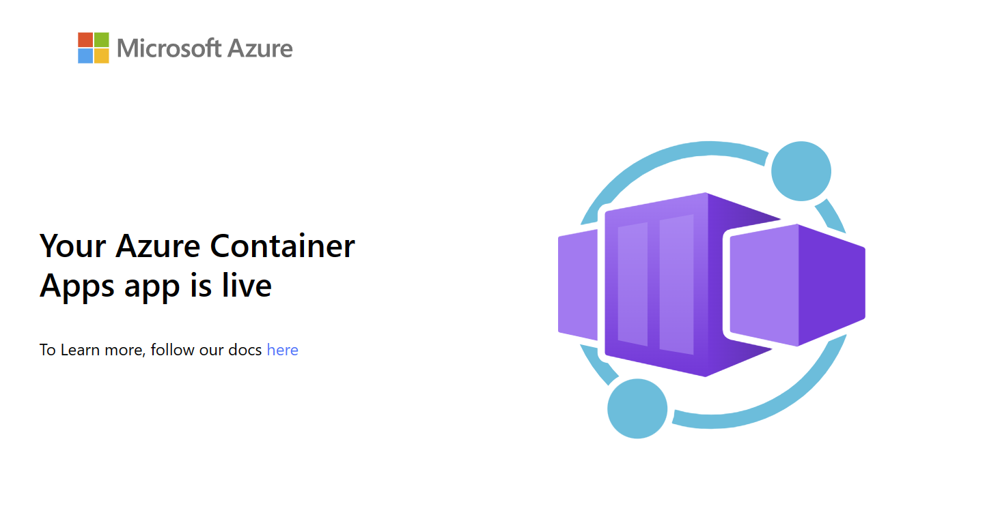

<br />

## Exercise 2: API アプリの展開

### Task 1: ローカルでのアプリケーションの実行

<details>
  <summary>C#</summary>

  - [Azure ポータル](#https://portal.azure.com)へアクセス

  - 事前展開済みの SQL Database である "**AdventureWorksLT**" の管理ブレードへ移動し、**接続文字列** をクリック

  - ADO.NET (SQL 認証) の接続文字列をコピー

  - Visual Studio Code の Explorer で "**src**" - "**CS**" - "**AspNetCoreApp**" - "**Api**" を選択

  - "**New File (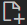)**" をクリック

    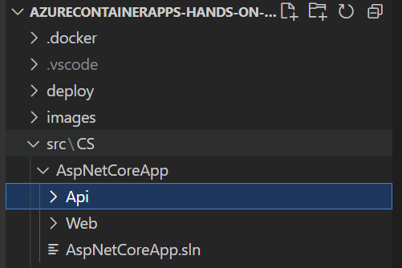

  - ファイル名を "**appsettings.Development.json**" に指定

  - 以下のコードを記述し、ファイルを保存

    ```
    {
        "sqlConnectionString": "SQL Database への接続文字列"
    }
    ```

    ※ 先の手順でコピーした SQL Database への文字列を使用

    ※ Password を指定

  - "**Terminal**" - "**New Terminal**" を選択し、ウィンドウ下部にターミナルを表示

  - Api ディレクトリへ移動

    ```
    cd src/CS/AspNetCoreApp/Api
    ```

  - アプリケーションを実行

    ```
    dotnet run
    ```

  - Web ブラウザを起動し、"**http://localhost:5000/api/Product/**" へアクセス

    

    ※ SQL Database から取得したデータが表示

</details>

<details>
  <summary>Java</summary>
</details>

<br />

### Task 2: Azure Container Registry の設定

- [Azure ポータル](#https://portal.azure.com)へアクセス

- Azure Container Registry の管理ブレードへ移動し、"**アクセス キー**" を選択

  ※ Azure Container Registry は事前に展開済み

- "**管理者ユーザー**" を有効に設定

  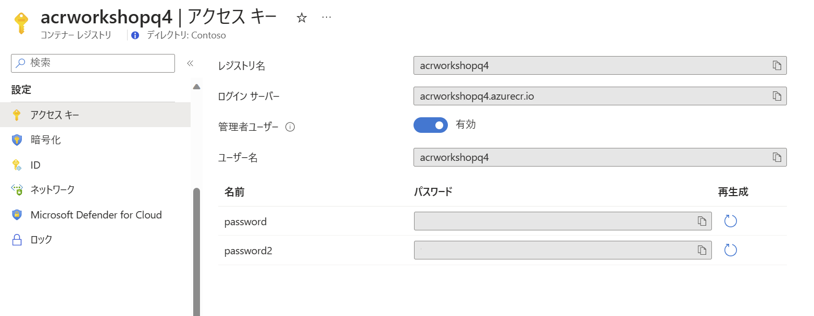

<br />

### Task 3: Docker イメージの構築

- デスクトップ上の "Ubuntu" ショートカットをダブルクリック

- 操作用のプロンプトが起動

- WSL で Windows 側のマウントされたディレクトリへ移動

  ```
  cd /mnt/c/Users/AzureUser/Documents/AzureContainerApps-Hands-on-Lab-2
  ```
- docker build コマンドを実行しイメージを構築

  <details>
    <summary>C#</summary>

    ```
    docker build -t yourregistry.azurecr.io/api:v1 -f .docker/CS/dockerfile_backend_api .
    ```

    ※ yourreregistry.azurecr.io をコンテナー レジストリのログイン サーバーに変更

    ※ コマンドのオプション

    - **-t**: 名前とタグを **名前:タグ** の形式で指定

    - **-f**: dockerfile のパスを指定

  </details>

  <details>
    <summary>Java</summary>
  </details>

- docker images コマンドを実行し、イメージが表示されることを確認

  ```
  docker images
  ```

<br />

### Task 4: イメージのレジストリへのプッシュ

- レジストリへログイン

  ```
  docker login yourregistry.azurecr.io
  ```

  ※ yourreregistry.azurecr.io を作成したコンテナー レジストリのログイン サーバーに変更

  ※ コンテナー レジストリのログイン サーバー名は管理ブレードのアクセス キーから確認可

- Username, Password を指定し、ログインを実行

  ※ コンテナー レジストリの管理ブレードのアクセス キーから取得できるユーザー名とパスワードを使用

- docker push を使用してレジストリへプッシュ

  ```
  docker push yourregistry.azurecr.io/app:v1
  ```

  ※ yourreregistry.azurecr.io を作成したコンテナー レジストリのログイン サーバーに変更

- Azure ポータルで作成したコンテナー レジストリの管理ブレードへアクセス

- 左側のメニューから「**リポジトリ**」を選択

  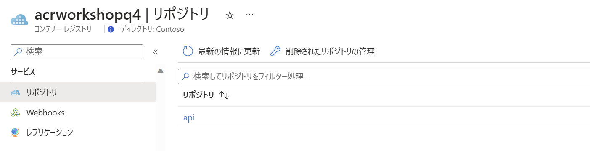

- リポジトリ内のイメージを確認

  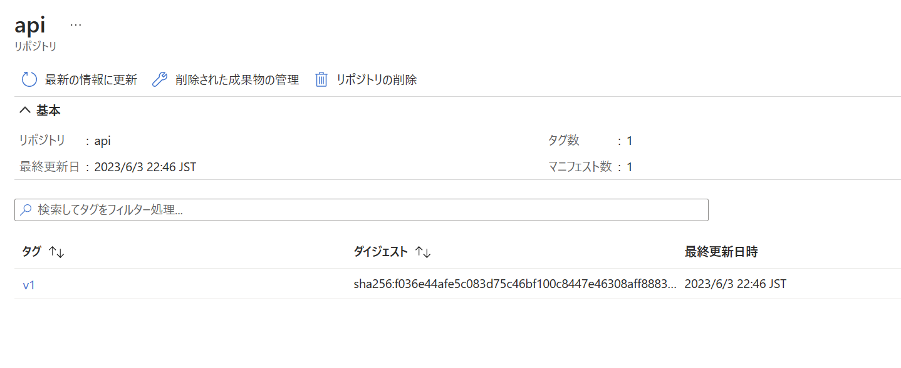

<br />

### Task 5: シークレットの登録

- [Azure ポータル](#https://portal.azure.com)へアクセス

- 展開したコンテナー アプリの管理ブレードへ移動し、"**シークレット**" を選択

- "**＋追加**" をクリック

  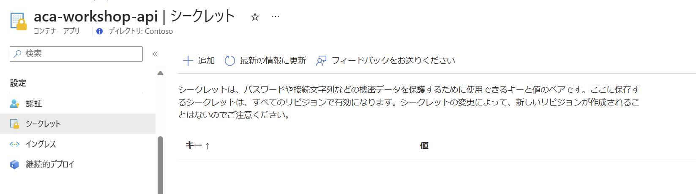

- SQL Database への接続文字列をシークレットへ追加

  - "**キー**": sqlconnectionstring

  - "**種類**": Container Apps シークレット

  - "**値**": SQL Database への接続文字列

    

- "**＋追加**" をクリック

  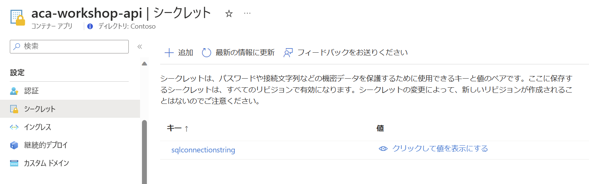

- Application Insights のインストルメンテーション キーをシークレットへ登録

  - "**キー**": applicationinsights-key

  - "**種類**": Container Apps シークレット

  - "**値**": インストルメンテーション キー

    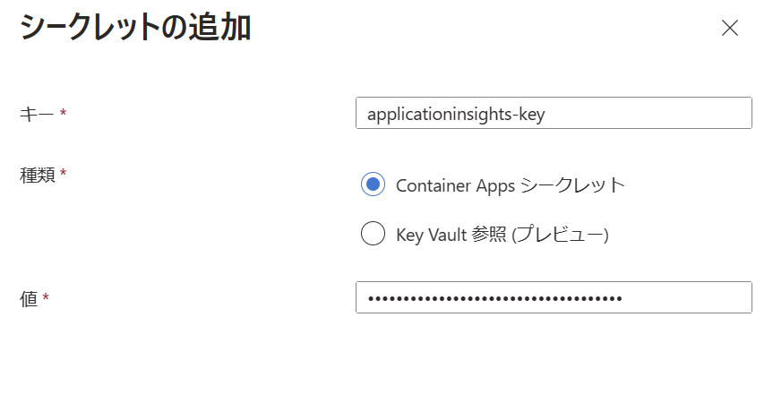

    ※インストルメンテーション キーは Application Insights 管理ブレードのプロパティから取得

    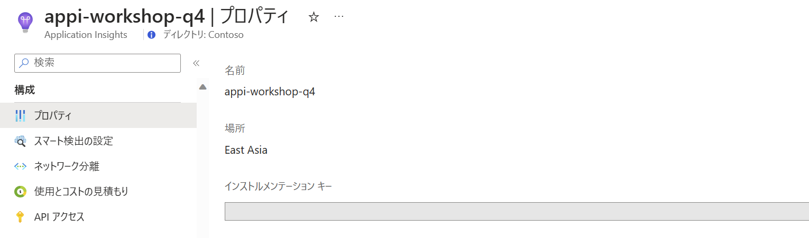

- ２つのシークレットの登録を確認

  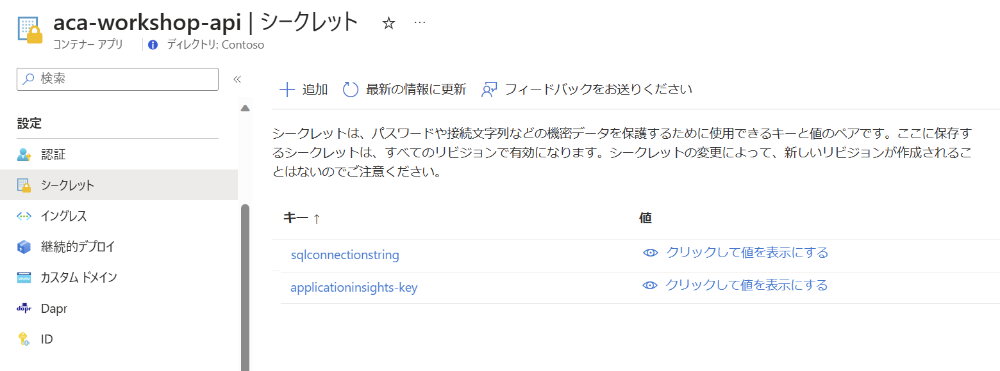

<br />

### Task 6: リビジョンの作成

- コンテナー アプリの管理ブレードへ移動し、"**リビジョン管理**" を選択

- "**＋新しいリビジョンを作成**" をクリック

  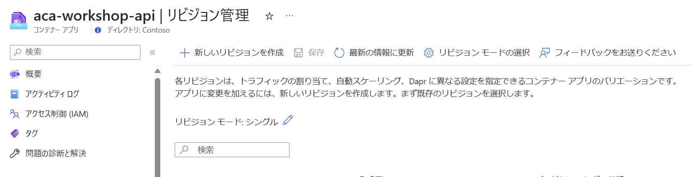

- クイックスタート イメージをチェックし "**削除**" をクリック

  

- コンテナー イメージの "**＋追加**" - "**アプリ コンテナー**" をクリック

  

- コンテナーの追加

  - "**コンテナーの詳細**"

    - "**名前**": mcw-backend-api (任意)

    - "**イメージのソース**": Azure Container Registry

    - "**認証**": 管理者資格情報

    - "**レジストリ**": ワークショップで使用中のコンテナー レジストリを選択

    - "**イメージ**": api

    - "**イメージ タグ**": v1

  - "**コンテナー リソースの割り当て**"

    - "**CPU コア**": 0.25

    - "**メモリ (Gi)**": 0.5
  
  - "**環境変数**"

    ※ "**＋追加**" をクリックし、以下２つを環境変数として追加

    - SQL 接続文字列

      - "**名前**": SqlConnectionString

      - "**ソース**": シークレットの参照

      - "**値**": sqlconnectionstring

    - Application Insights インストルメンテーション キー

      - "**名前**": ApplicationInsights__InstrumentationKey

      - "**ソース**": シークレットの参照

      - "**値**": applicationinsights-key

    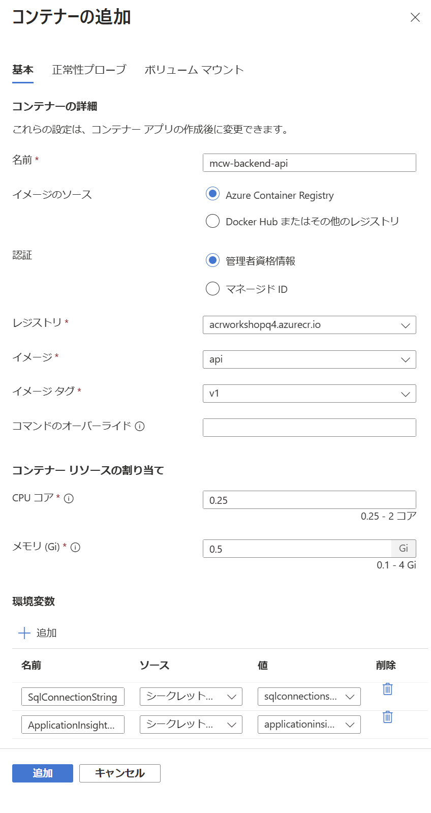

- "**追加**" をクリック

- "**作成**" をクリック

  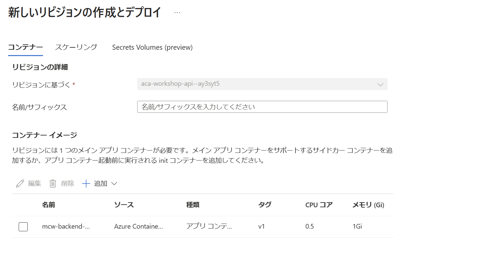

- 新しく展開したリビジョンの実行状態が Running であることを確認

  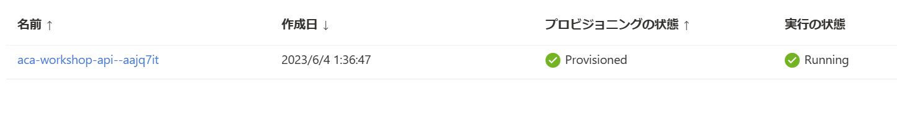

- "**概要**" タブを選択し、"**アプリケーション URL**" をコピー

- Web ブラウザでコピーした FQDN の /api/Product エンドポイントへアクセス

  

<br />

## Exercise 3: マネージド ID による Azure リソースへのアクセス

### Task 1: システム割り当て済みマネージド ID の有効化

- コンテナー アプリの管理ブレードから "**ID**" を選択

- システム割り当て済みの状態を "**オン**" に変更

  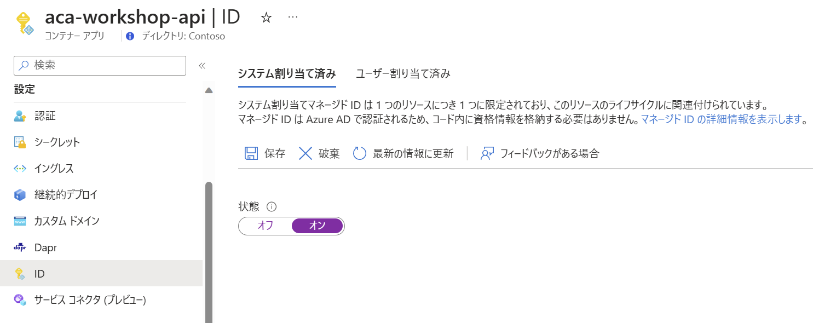

- "**保存**" をクリック

- 確認のメッセージが表示されるので "**はい**" をクリック

  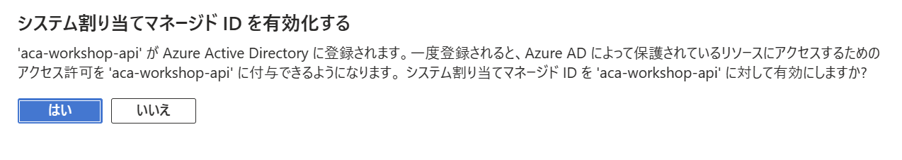

- システム割り当て済みマネージド ID が有効化されたことを確認

  

<br />

### Task 2: SQL Database のアクセス許可設定

- "**AdventureWorksLT**" の管理ブレードへ移動し、"**クエリ エディター (プレビュー)**" を選択

- Active Directory 認証でログイン

  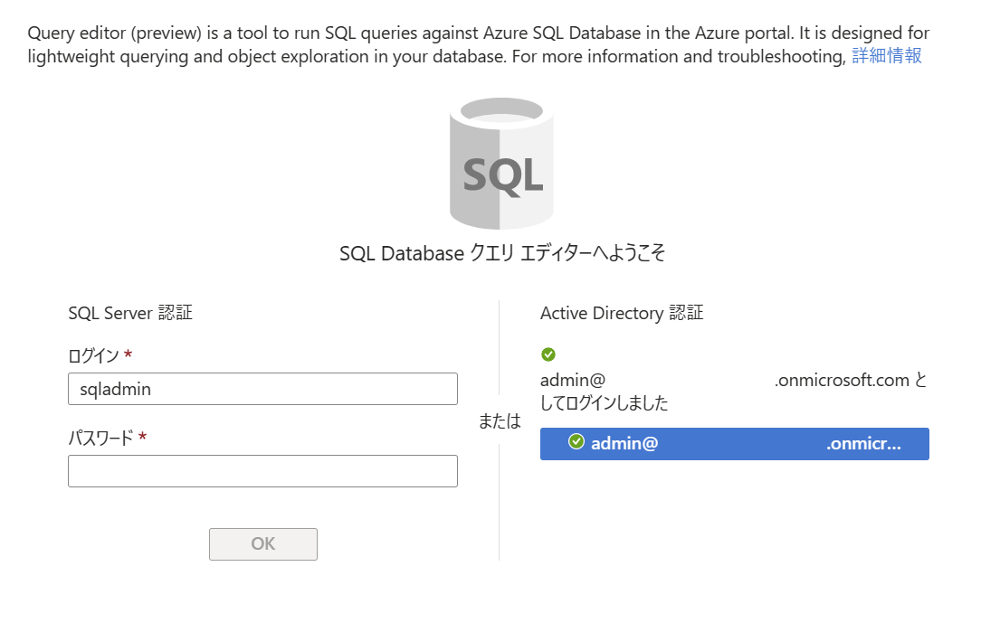

- SQL プロンプトでコマンドを実行し、マネージド ID へアクセス許可を付与

  ```
  CREATE USER [your_container_apps] FROM EXTERNAL PROVIDER;
  ALTER ROLE db_datareader ADD MEMBER [your_container_apps];
  GO
  ```

  ※ your_container_apps をコンテナー アプリ名に変更

  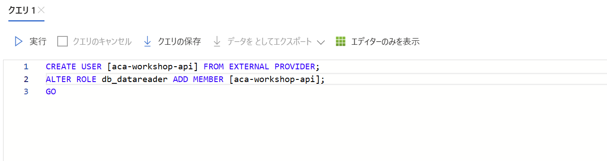

- 正常にクエリが実行されたことを確認

  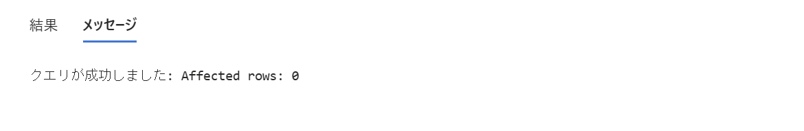

<br />

### Task 3: Key Vault のアクセス許可設定

- 事前展開済みの Key Vault の管理ブレードへ移動し、"**アクセス制御 (IAM)**" を選択

- "**＋追加**" - "**ロールの割り当ての追加**" をクリック

  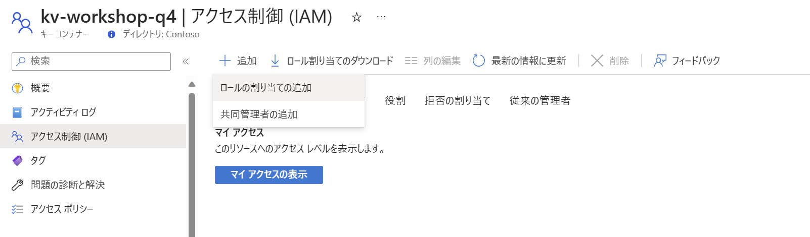

- "**キーコンテナー シークレット ユーザー**" を選択し、"**次へ**" をクリック

  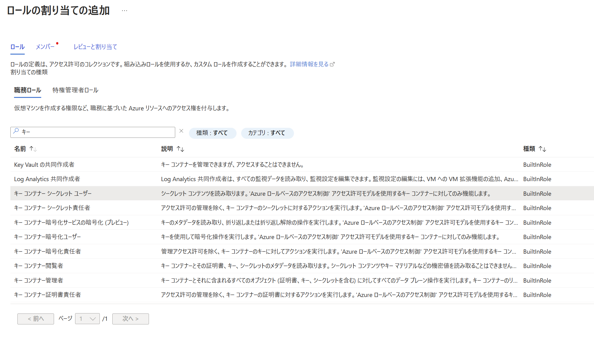

- "**アクセスの割り当て先**" で "**マネージド ID**" を選択し、"**＋メンバーを選択する**" をクリック

  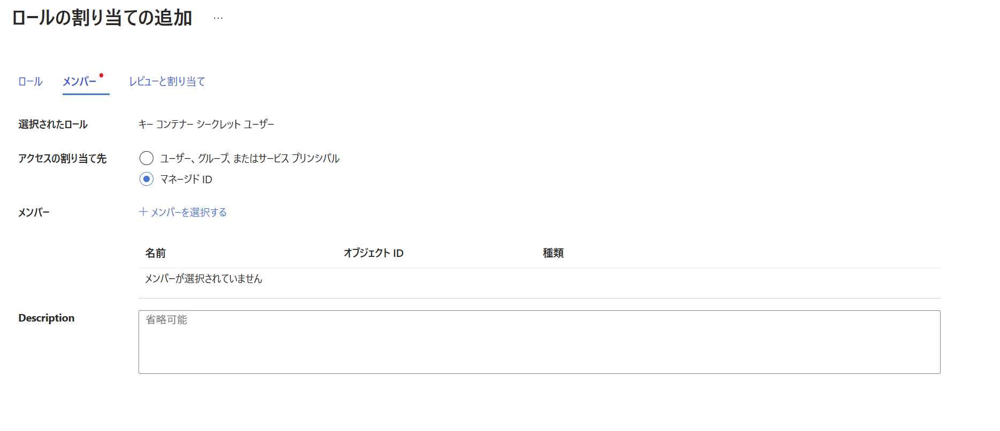

- マネージド ID の選択

  - "**サブスクリプション**": ワークショップで使用中のサブスクリプション

  - "**マネージド ID**": コンテナー アプリ

  - "**選択**": API アプリを展開したコンテナー アプリを選択

    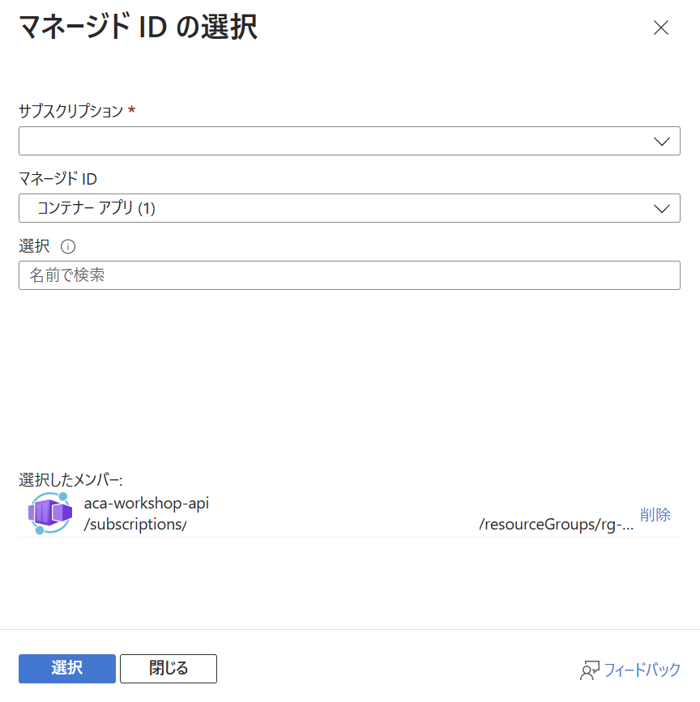

- "**選択**" をクリック

- "**メンバー**" にコンテナー アプリが表示されていることを確認し、"**次へ**" をクリック

  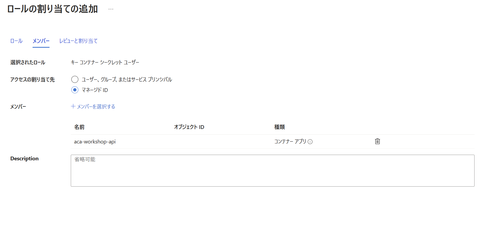

- "**レビューと割り当て**" をクリック

  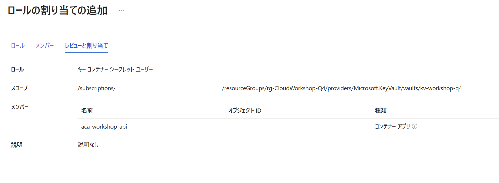

- ビューを表示し、キーコンテナー シークレット ユーザーにコンテナー アプリが表示されていることを確認

  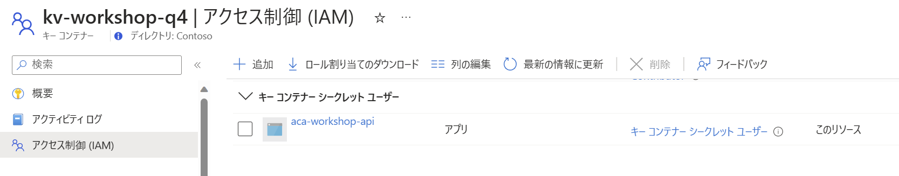

<br />

### Task 4: Key Vault へのシークレットの登録

- "**シークレット**" を選択し、"**＋生成/シークレット**" をクリック

  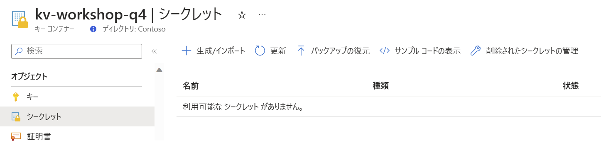

- シークレットの作成

  - "**アップロード オプション**": 手動

  - "**名前**": SqlConnectionString

  - "**シークレット値**": SQL Database への接続文字列 (Azure AD 認証)

    ```
    Server=tcp:{your_sql_server}.database.windows.net,1433;Initial Catalog=AdventureWorksLT;Authentication=Active Directory MSI;
    ```

    ※ {your_sql_server} を使用中の SQL Server 名へ変更

    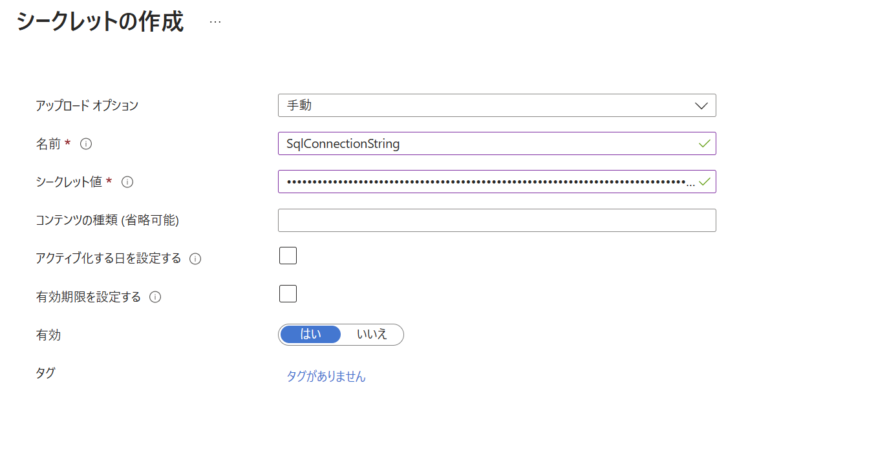

- "**作成**" をクリック

- 登録したシークレットをクリック

  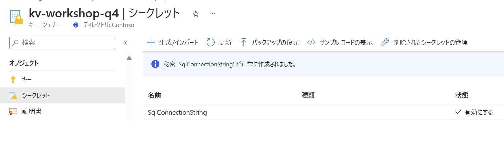

- 現在のバージョンに表示される文字列をクリック

  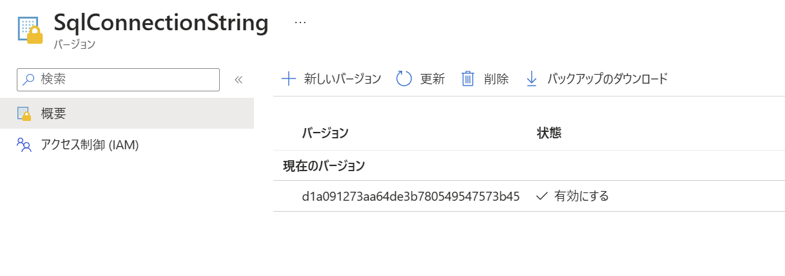

- シークレット識別子をコピー

  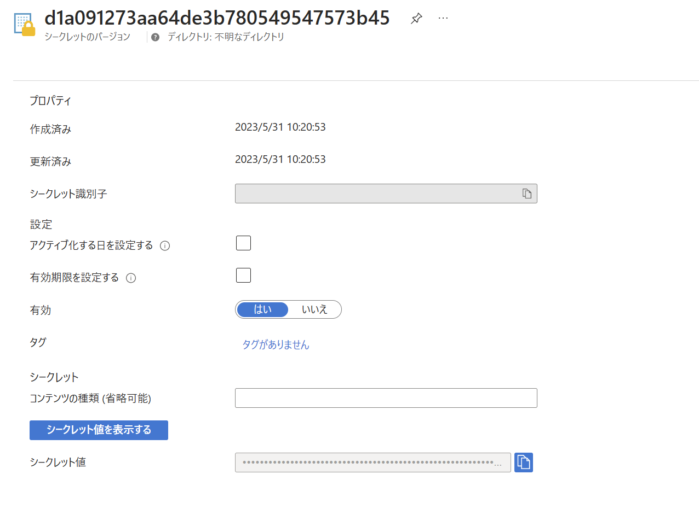

- "**閉じる**" をクリック

<br />

### Task 5: コンテナー アプリのシークレットの更新

- コンテナー アプリの管理ブレードへ移動し、"**シークレット**" を選択

- sqlconnectionstring (SQL Database への接続文字列を登録したシークレット)をクリック

  

- シークレットの編集

  - "**キー**": sqlconnectionstring

  - "**種類**": Key Vault 参照 (プレビュー)

  - "**Key Vault シークレット URL**": コピーしたシークレット識別子

  - "**マネージド ID**": システム割り当て

  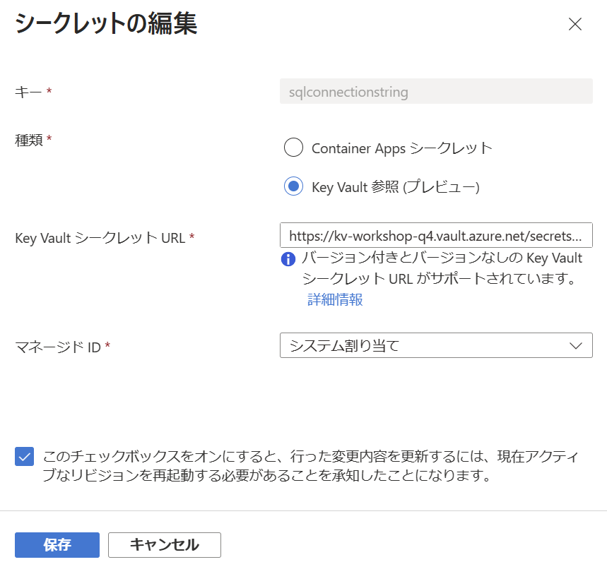

  - チェックボックスにチェックを付け、"**保存**" をクリック

- ポータル画面の右上の  をクリックし、Cloud Shell を表示

- リビジョンを再起動

  ```
  az containerapp revision restart -n {your_container_app} -g {your_resource_group} --revision {revision_name}
  ```

  ※ {your_container_app}, {your_resource_group} をコンテナー アプリ名、リソース グループ名に変更

  ※ {revision_name} はリビジョン管理から取得

- "**概要**" タブを選択し、"**アプリケーション URL**" をコピー

- Web ブラウザでコピーした FQDN の /api/Product エンドポイントへアクセス

  

<br />
